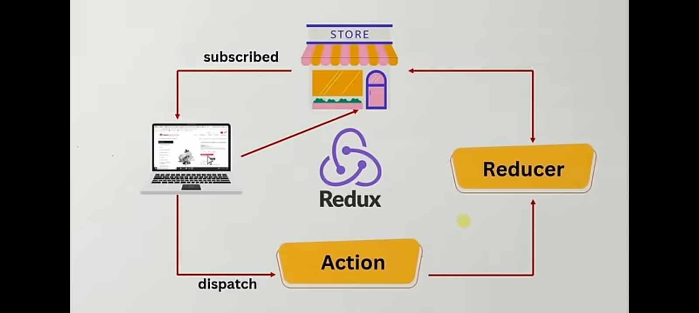

# Redux Core Concepts Guide

## Redux Introduction

Redux is a predictable state container for JavaScript applications, particularly useful for managing complex application states in a consistent way.

## REDUX - THUNK Guide

- [Redux Thunk & Async Operations](REDUX_THUNK.md) - Learn how to handle asynchronous operations and side effects in Redux using Redux Thunk middleware

## Core Concepts

### State Management

- **Store**: Central state container
- **Actions**: Plain objects describing what happened
- **Reducers**: Pure functions that specify state changes
- **Dispatch**: Method to send actions to the store

### Redux Flow

1. Action is dispatched
2. Store runs the reducer function
3. Root reducer combines output of multiple reducers
4. Store saves complete state tree

## Redux vs useReducer

### useReducer

- Local state management
- Component-level state
- Simpler implementation
- Good for component-specific logic
- No middleware support
- No dev-tools integration

### Redux

- Global state management
- Application-wide state
- More structured implementation
- Great for complex state logic
- Middleware support
- Powerful dev-tools

## When to Use Redux?

- Complex state logic
- Need for centralized state
- Large-scale applications
- Team collaboration
- State persistence
- Complex data flows

## Best Practices

1. Keep store immutable
2. Use action creators
3. Implement proper error handling
4. Follow Redux style guide
5. Use Redux DevTools
6. Keep reducers pure

## Additional Resources

- [Redux Documentation](https://redux.js.org/)
- [Redux Style Guide](https://redux.js.org/style-guide/style-guide/)
- [Redux DevTools](https://github.com/reduxjs/redux-devtools)
- [Redux Thunk Guide](REDUX_THUNK.md) - Detailed guide on handling async operations with Redux Thunk middleware
